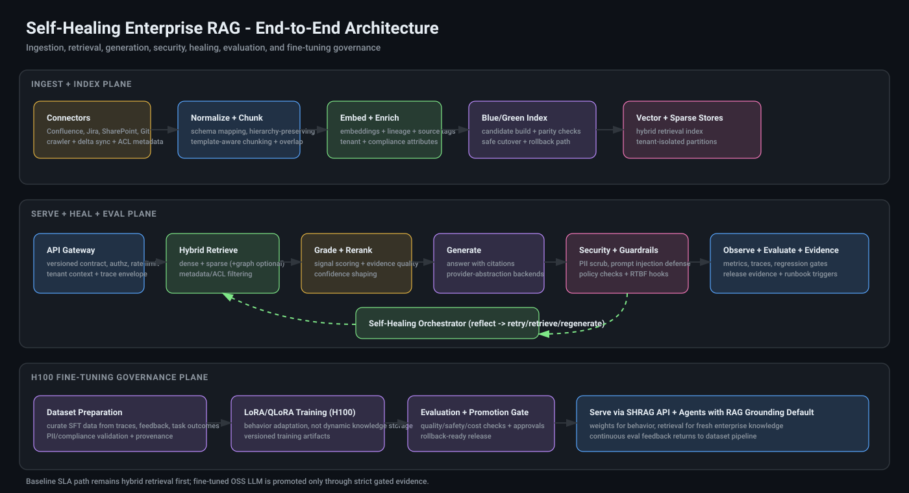

# Self-Healing Enterprise RAG

Enterprise-grade Retrieval-Augmented Generation (RAG) platform with a self-healing response loop, strict security controls, benchmark harnessing, and fine-tuning readiness gates for OSS LLM deployment.



## What This Is

This repository provides a production-style RAG stack for enterprise knowledge and operations workflows:

- Hybrid retrieval (`dense + sparse`) with quality-aware ranking
- Guardrailed generation with citation-first behavior
- Self-healing loop (`reflect -> retry/retrieve/regenerate`)
- Enterprise controls (RBAC/tenant/PII/prompt-injection/RTBF)
- Release gates with auditable evidence artifacts
- Fine-tuning readiness lane aligned to H100-backed OSS LLM strategy

## End-to-End Flow

1. Source ingestion from enterprise systems (Confluence/Jira/SharePoint/Git/etc.)
2. Normalize + metadata/ACL enrichment + chunking
3. Embedding/index pipeline (tenant-aware)
4. Query request through API policy controls
5. Hybrid retrieval + reranking + grading
6. Answer generation with citations
7. Guardrails + self-heal if quality/policy checks fail
8. Evaluation + observability + release evidence

## Quick Start

```bash
cd self-healing-rag

# Start API
PYTHONPATH=src ./.venv/bin/python -m uvicorn shrag.api.main:app --host 127.0.0.1 --port 8000
```

Health checks:

```bash
curl -sS http://127.0.0.1:8000/healthz
curl -sS http://127.0.0.1:8000/v1/healthz
```

## Minimal RAG Example

Ingest:

```bash
curl -sS -X POST http://127.0.0.1:8000/docs \
  -H "Content-Type: application/json" \
  -H "X-API-Version: 2026-05-01" \
  -H "X-Tenant-Id: demo-tenant" \
  -H "X-Roles: writer" \
  -H "X-User-Id: demo-user" \
  -d '{"documents":[{"document_id":"doc-1","text":"RAG combines retrieval and generation."}]}'
```

Query:

```bash
curl -sS -X POST http://127.0.0.1:8000/query \
  -H "Content-Type: application/json" \
  -H "X-API-Version: 2026-05-01" \
  -H "X-Tenant-Id: demo-tenant" \
  -H "X-Roles: reader" \
  -H "X-User-Id: demo-user" \
  -d '{"query":"What is RAG?","top_k":5}'
```

## Enterprise Verification Commands

```bash
# Unit/integration quality
make local-ci-gate

# Scale, DR, connectors, release quality
make release-gate
make release-gate-strict

# Fine-tuning lane (simulated local path)
make finetune-readiness-simulated
make finetune-readiness
```

## ERB Benchmark Harness

```bash
export SHRAG_ERB_API_VERSION=2026-05-01
export SHRAG_ERB_ROLES=writer
export SHRAG_ERB_USER_ID=erb-bench-runner
export SHRAG_ERB_TENANT_ID=erb-bench

make erb-bench ERB_DIR=/path/to/EnterpriseRAG-Bench SHRAG_BASE_URL=http://127.0.0.1:8000
```

Outputs:

- `.state/erb-ingest-manifest.json`
- `.state/erb-answers.jsonl`
- `.state/erb-results/*`
- `.state/erb-bench-report.json`

## Fine-Tuning Positioning (H100 Use Case)

This platform is aligned to enterprise OSS LLM fine-tuning strategy:

- Fine-tune model behavior (terminology, reasoning patterns, workflow structure)
- Keep dynamic enterprise knowledge in RAG (freshness + governance)
- Use gated promotion with rollback and evidence artifacts

## Repository Structure

```text
src/shrag/         # core runtime (api, retrieve, generate, security, heal, eval)
tests/             # unit/integration/load/scale/bench
ops/               # verification gates, training ops, evidence publishing
docs/              # architecture, runbooks, compliance, evidence vault
```

## Documentation

- HTML docs portal: `docs/index.html`
- Runbooks: `docs/runbooks/` and `ops/runbooks/`
- Evidence snapshots: `docs/evidence/`

